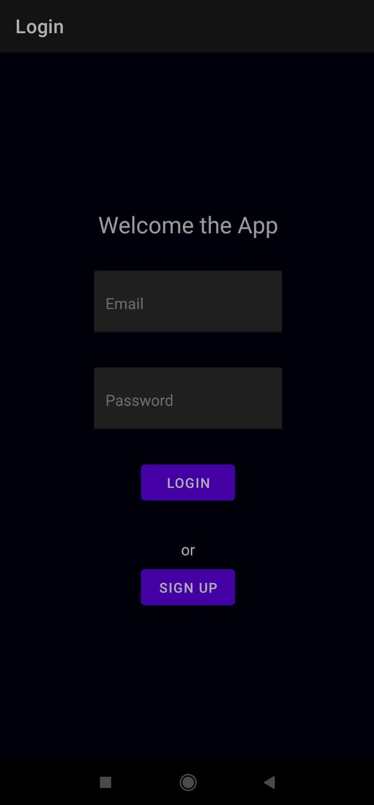

# React Native Authentication with Context Api

This repository is an example of authentication using Context API in react native. The example covers 3 screens(Login, Signup, and Home). You can navigate between screens and log in to see the home page which requires authentication. You will need an account to log in and can create a new one through sign-up screen. 

### Installation

```sh
$ git clone https://github.com/mbozkaya/react-native-authentication-context-api.git
$ cd react-native-authentication-context-api/app/
$ npm install
$ expo install
$ expo start
```

Now you can reach out to the application through the Expo app you used on your phone.

### Dependencies

Here are libraries I used extra 

| Library | Purpose |
| ------ | ------ |
| react-native-paper | To provide better UI with material design |
| react-native-async-storage/async-storage | To keep data into local storage |
| react-navigation/native | Navigation container |
| react-navigation/native-stack | Navigation stack |


### Screens




## Contributing
Pull requests are welcome. 

## License
[MIT](https://choosealicense.com/licenses/mit/)

#
#